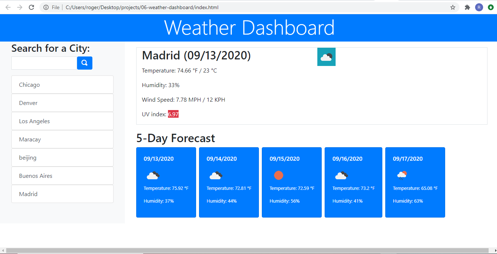
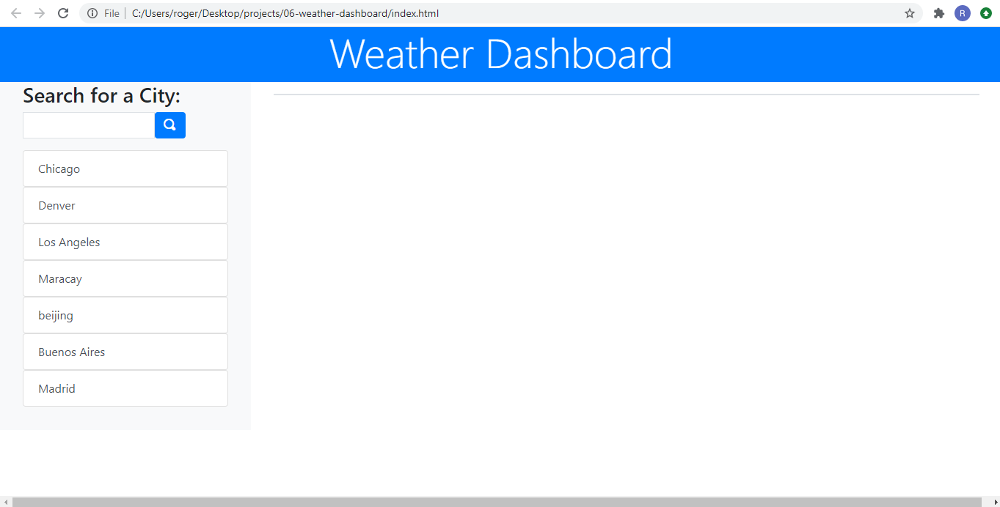
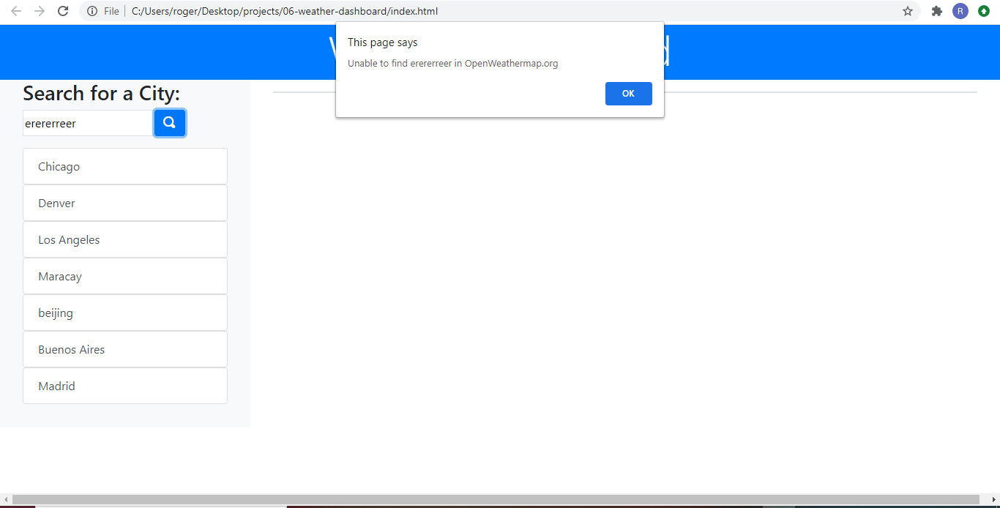
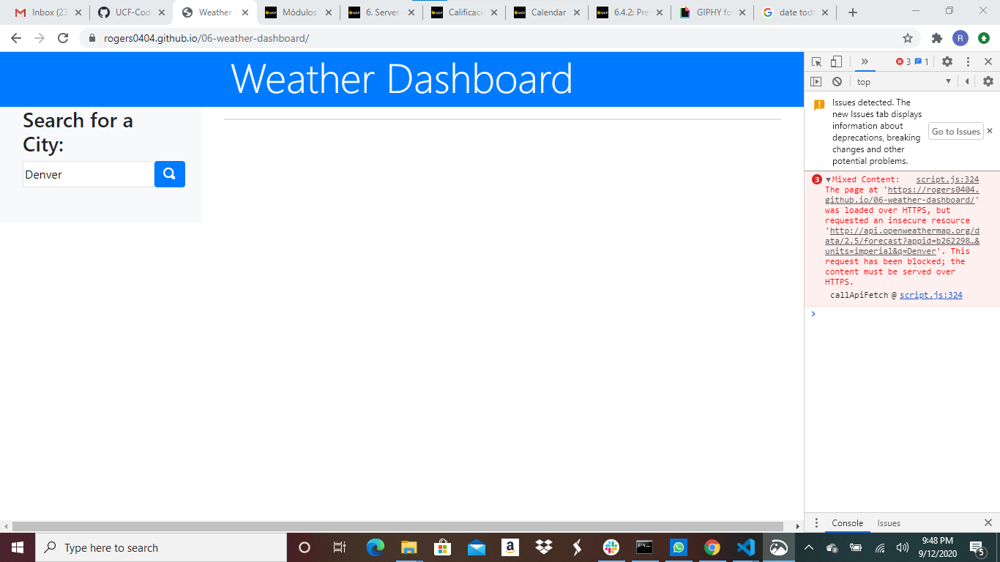

# 06-weather-dashboard
06 Assignment. Coding Bootcamp UCF

URLs

Deployed Application: 
    https://rogers0404.github.io/06-weather-dashboard/

GitHub Repository:
    https://github.com/rogers0404/06-weather-dashboard.git 
    
    git@github.com:rogers0404/06-weather-dashboard.git 

Sixth Assignment in UCF Code Boot Camp

1. The Task was divided in several parts to develop the application
    - First Part was the development of the framework of the challenge. HTML, Bootstraps, File Structure and putting the links for Jquery, Bootstrap, script.js. 

    - Second part was related to work with fetch and the responses. It was signed up into Openweathermap.org and it was generated two API KEY. Initially there was a problem because the functionality of the site, the keys took time to activate them. When the API Keys was setting up, it got two responses. one for the general information like humidity, wind speed, temperature, date and weather condition and the other response was about the UV index through out the latitude and longitude from de first response. I was develop the functions [callApiFetch()], [createDataObject()] to deal with the request to the server and build the Array of object to store the Weather information.  

    - Third part was divided in 5 parts to match the Acceptance Criteria
    * It was created a function [weatherHTML()] to deal with the DOM manipulation and create the elements to present the information in HTML using Bootstraps.
    * The information about humidity, temperature, wind speed, UV index, and weather conditions was presented in the [weatherHTML()] for the current conditions. It was taken the first element of the list items inside the weather response as a current  weather condition. It was created the functions [cleaningElement()] to clean the containers, [converTemp()] to convert the Fahrenheit degree to Celsius degree and show it in the HTML, [convertWSpeed()] to convert MPH to KPH and show it in the HTML, and [findUV()] to look at the category about the intensity of UV index; this criteria was adopted following the site https://www.epa.gov/sites/production/files/documents/uviguide.pdf.
    * Related to UV index, as it is explained in the point before, it was created a function to get the background color according a criteria and show in the HTML the intensity of UV index. It was used Low, Moderate, High, Very High and Extreme.
    * In the function [weatherHTML()] it is shown the dynamic generated DOM HTML using classes from bootstrap such as card, d-flex, flex-fill and colors for text and background. I was also shown the future weather informations taking just the information when the time reach 9 am in the index of the response. It was created the functions [searchForDate9AM()] which return true or false and you get the index and store the information, [formatDate()] to get the date as the mock up show.  
    * It was created a functions to save the city in localStore [saveCity()], and [loadCity()] to show the historic cities in the HTML. It was created a JQuery listener for the buttons created dynamically with and attribute call "attr" and its value the city stored in localStore. 

    - The last part was organizing the code in script.js and fixing some errors in DevTools
        * It was created a function alert [displayAlertMessage()] to handle the error through out the application..
        * It was left the solution when:
            . the user put some wrong input for a city and the response give an error 404, telling that the server can give and appropiate response, Even though it is shown a error alert message about that city can not be found. The error is still persist. 
            . When you click in the historic buttons for each city saved a message it is shown telling that city is already added to the historic cities. It works, it does not look very well because this message is when a city is typed in the input and the city is in the historic. 
            . On the link of Deployed Application in GitHub there are some error about HTTPS and GitHub block the response. See the Screenshot # 6 (solved). But in local everything is ok. 
            
            You must apply in every link you have. The solution is the following:
                you have to update your code like this.
                    var urlIcon;
                    if (location.protocol === 'http:') {
                        urlIcon = 'http://openweathermap.org/img/wn/';
                    } else {
                        urlIcon = 'https://openweathermap.org/img/wn/';
                    }

        * It has been written comments along the code to explain every task, and also the repository has been commited.

##Screenshots:

### Screenshot 1. From the Assignment

### Screenshot 2

### Screenshot 3

### Screenshot 4

### Screenshot 5

### Screenshot 6
